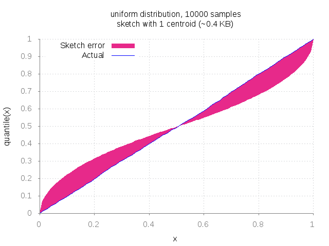
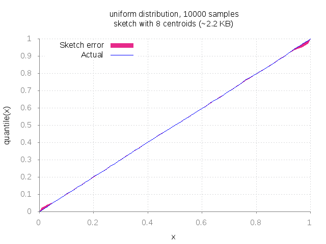
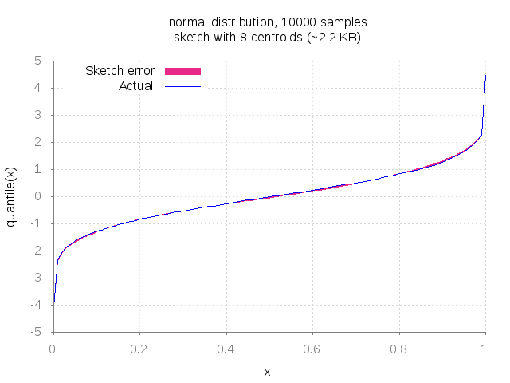
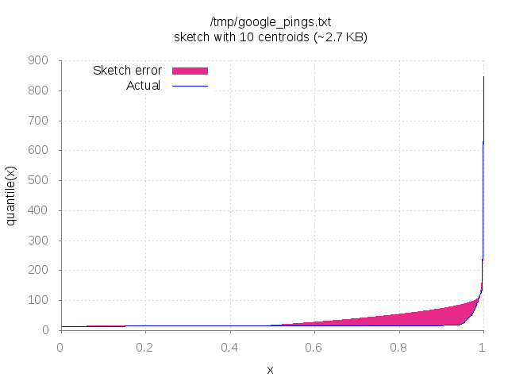
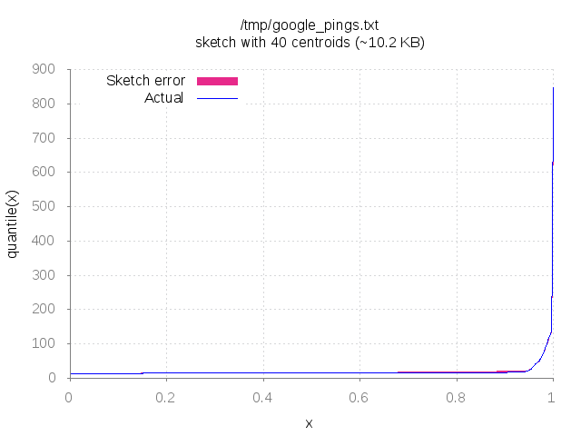
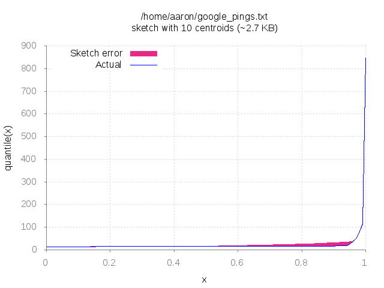

histosketch
===========

A golang implementation of the streaming histogram sketch described in Ben-Haim
and Tom-Tov's [A Streaming Parallel Decision Tree Algorithm](http://www.jmlr.org/papers/volume11/ben-haim10a/ben-haim10a.pdf).
The sketch has a fixed size and offers quick estimates of quantiles and counts of
observed values below a threshold.

Useful for recording and analyzing a histogram from a stream of data or in map/reduce computations.

How it Works
------------

Each sketch is an ordered list of centroids. Each centroid represents a multiset of points and is stored
as an average value and a count. For example, a centroid for the multiset {4,4,5,5} would have an average of 4.5
and a count of 4.

When a value is added to the sketch, it's added as a centroid of count 1 and inserted into the
sorted list at the appropriate position based on its value. If the list of centroids is too large after the new
centroid has been inserted, the entire list is scanned to find the pair of adjacent centroids whose average values
are closest together. That pair of centroids is then merged into a single centroid.

Quantiles and sums can be estimated by defining a right trapezoid by the two centroids
that border the point we're looking for and interpolating the value using that trapezoid. For example,
to compute the number of values less than 100, we'd iterate through all centroids, adding their counts
until we get to a pair of centroids whose sums border 100. At that point, we use the average values and counts of
the two bordering centroids to estimate how many points fall between the two centroids. If the first centroid has
average value 25 and count 100 and the second centroid has average value 28 and count 300, we'd define a trapezoid with
the four corners (25,0), (25, 100), (28, 0), (28, 300) and use the area of that trapezoid to interpolate
the value of the missing point. Quantile estimation is done through a similar trapezoidal model but involves
solving a quadratic.

Examples
--------

Create a histogram sketch by specifying a maximum number of centroids. The sketch uses two `float64`s to
represent each centroid, so the resulting sketch will take up about 1 KB for every 8 centroids.

    h := histosketch.New(32)

Alternatively, if you have a sample of the data, you can bootstrap the sketch with the
optimal centroid decomposition for that sample:

    h := histosketch.NewFromSample(sample, 32)

The centroid decomposition returned by `NewFromSample` is optimal with respect to the sum of squared
distances of each data point to its closet centroid. However, it takes time on the order of the
length of the sample squared times the number of centroids to compute, whereas creating a sketch with `New` and
then adding each sample individually takes time on the order of the length of the sample times the
number of centroids. In streaming contexts, `New` may be the best option, but if you happen to have a
small sample of data and enough time to create the optimal decomposition, `NewFromSample` may improve
results.

Once you've created a sketch, add some values. You can add individual values with `Add`:

    h.Add(100.0)
    h.Add(101.0)

or multiple data values in one call with `AddMany`:

    h.AddMany(102.0, 2)  // Same effect as two calls to s.Add(102.0)

Each call to `Add` or `AddMany` takes time on the order of the maximum number of centroids configured for the sketch.
After you've added some values, you can get quantile estimates:

    // Returns estimate of the least value greater than 99% of values added.
    h.Quantile(0.99)

Or get estimates of the number of elements observed that are at most given value:

    // Returns estimate of the number of values added that are at most 123.
    h.Sum(123)

`Quantile` and `Sum` both take time on the order of the maximum number of centroids for the sketch.

Finally, you can merge two sketches together:

    h.Merge(g)  // Merges all entries in g with h, storing the result in h.

You can serialize a sketch as a [gob](https://golang.org/pkg/encoding/gob/). See the tests for an example.

Choosing a maximum number of centroids
--------------------------------------

There aren't any good theoretical guarantees on the accuracy of the Ben-Haim-Tom-Tov sketch.
However, given a fixed amount of space to store a sketch of a histogram and know upfront knowledge
of what Quantile/Sum queries need to be serviced, the centroid decomposition and linear interpolation
between centroids based on weight is a very reasonable model.

This repo contains a utility `graphs` that will generate gnuplot
graphs of the error involved in various scenarios. You can use this utility to play around with
the effects of different sketch sizes on some common distributions or on a sample of your data.

For example, 1 centroid is clearly not
enough to accurately estimate quantiles for 10,000 samples from a uniform [0,1] distribution:

However, you don't have to go much bigger: even 8 centroids will fit that distribution well:

You can also represent the quantile function for 10,000 samples from a Normal(0,1) distribution
pretty well with 8 centroids:

Less well-behaved distributions may require more centroids.
I pinged google.com 10,000 times and recorded the resulting response times in a file (saved in
this repo as `data/google_pings`). These
response times are heavily skewed, with a minimum around 10 milliseconds and a maximum
of almost 900 milliseconds, but 95% of the values are less than 25 milliseconds. A sketch
with 10 centroids loses accuracy between 0.5 and .99:

But bumping the number of centroids to 40 estimates the quantile function much more faithfully:

In practice, you can probably get a rough idea of how this sketch will work on your data by putting
a sample in a file (one value per line) and running the `graphs` utility on it to generate a graph:

    graphs --centroids=32 --datafile=mydata.txt | gnuplot

then viewing the plot stored at /tmp/plot.png. Run `graphs --help` to see a list of all command-line
flags.

Bootstrapping with a sample
---------------------------

The optimal 1-D centroid decomposition with respect the the sum of squared distances of each point
to its closest centroid for n points and k centroids can be computed in time O(n^2 k) and space
O(nk) using dynamic programming. This is what `NewFromSample` does. In practice, bootstrapping a
histosketch with a large a sample helps accuracy.

Here's a graph of the quantile error between the optimal 10-centroid decomposition for the google
pings dataset (obtained by calling `NewFromSample` on the entire set of 10,000 values) and the actual
histogram:

Comparing this graph to the 10-centroid graph created with `New` above on the same dataset, you can
see that the quantile error resulting from `NewFromSample` on the entire dataset is much smaller
than the quantile error resulting from calling `New` and then `Add`ing values one-by-one.

Alternatives
------------

Some notable alternatives to the Ben-Haim-Tom-Tov sketch for general-purpose histogram sketches are the
[q-digest](http://www.inf.fu-berlin.de/lehre/WS11/Wireless/papers/AgrQdigest.pdf) and the
[t-digest](https://github.com/tdunning/t-digest/raw/master/docs/t-digest-paper/histo.pdf).

One advantage of q-digests is that there are known theoretical bounds on their error, but the implementation
of q-digests requires expensive compression and pruning operations and q-digests only accept integer values.
In addition, q-digests grow with their input and are not meant to be a fixed-size sketch.

Like the Ben-Haim-Tom-Tov sketch, the t-digest is represented by an ordered list of centroids and can
handle floating point values. The t-digest optimizes for accuracy in extreme quantiles
by restricting the size of centroids based on the quantile value, so it most likely does a better job
of estimating extreme quantiles than the Ben-Haim-Tom-Tov sketch. However, because of this optimization,
the t-digest does not support fixed-size sketches. The extreme quantile optimization also
makes insertion a little more complicated, since periodic re-shuffling is needed for some input
sequences.

Installation
------------

    go get github.com/aaw/histosketch